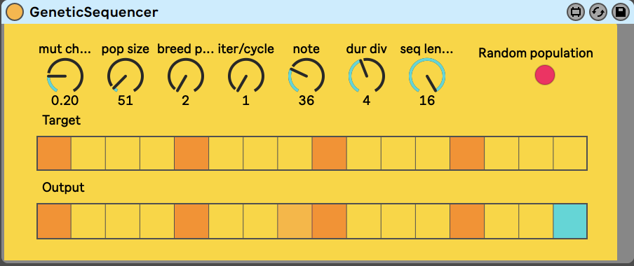

# Max4Live Genetic Sequencer

Uses [genetic algorithm](https://en.wikipedia.org/wiki/Genetic_algorithm) to generate note on/note off patterns.

## Installation

Download the following repo (for example by clicking `Clone or download` button at the side of github) and unzip its contents in dir that Ableton recognizes. If no such dir is added to Ableton it can always be added by clicking on `Add Folder...` button at the right sidebar in Ableton.

## Usage
First sequencer allows to set target steps pattern and the second one is used to display what is currently output by the sequencer.

### Controls
- *mutation chance*: how big is the probability of sequence "genome" mutation - results in random steps flipping their state
- *population size*: how big is the population that takes part in creating patterns. The bigger population the higher chance of `target` pattern appearing
- *breeding population size*: how many genomes are selected to create a new population at the end of each cycle
- *iter/cycle*: how many iterations of breeding cycle are run at end of each cycle. Higher values make it possible to "reach" target pattern in fewer cycles.
- *note*: midi note value which is output by sequencer
- *dur div*: sets note lengths in dividiends of quarter note (synced to tempo). For example value `4` will result in note length of one sixteenth and value `1` will result in note length of one quarter.
- *random population* button: randomizes the population.
